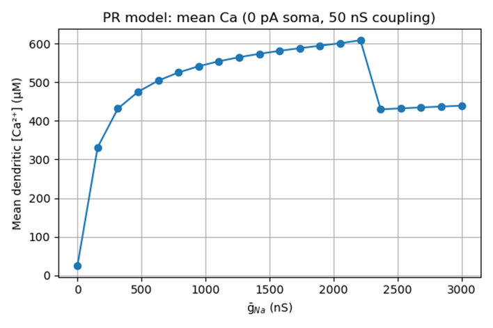
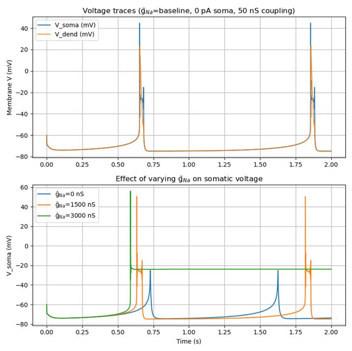
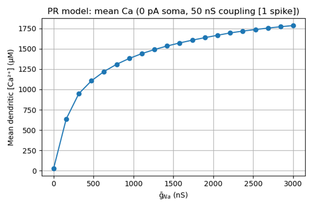
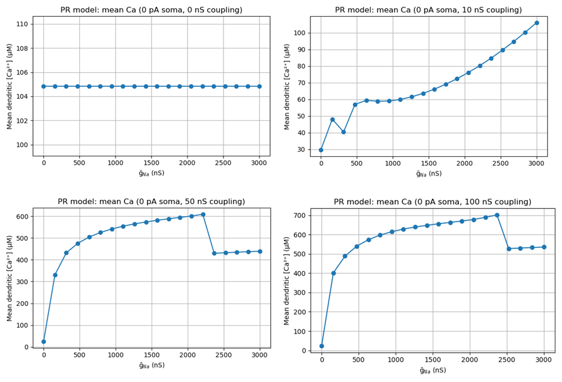
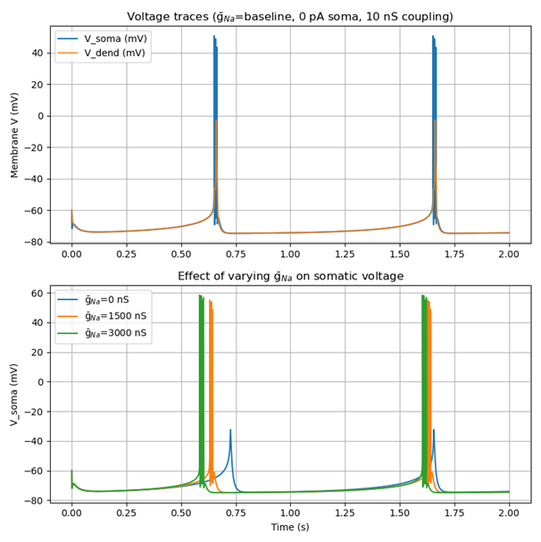
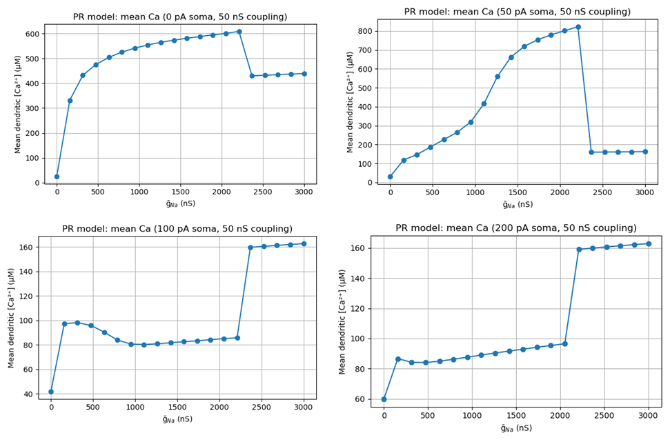
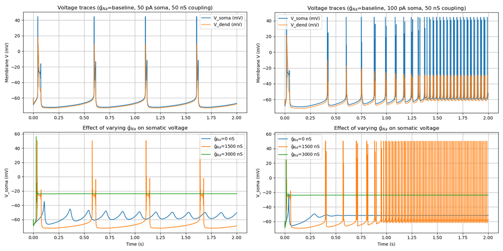

# Pinsky–Rinzel Model: Dependence of Dendritic Calcium on Sodium Conductance

Stan Wan  
Professor Paul Miller  
NBIO 136  

## Abstract
Investigated how variations in the maximal sodium conductance (ḡₙₐ) modulate the mean dendritic calcium concentration in the two‐compartment Pinsky–Rinzel burster. Somatic current injection (100 pA) and soma–dendrite coupling (50 nS) evoke bursting, and I quantify calcium entry as ḡₙₐ is swept from 0 to 3000 nS. Observed a rise‐peak‐decline relationship, suggesting an optimal range of sodium conductance for calcium homeostasis.

## 1. Introduction
- Background: Role of sodium and calcium channels in neuronal excitability and homeostatic regulation.
- Model choice: The Pinsky–Rinzel two‐compartment model is appropriate for studying dendritic Ca dynamics. 
- Objective: Quantify how mean dendritic [Ca²⁺] depends on ḡₙₐ under controlled somatic drive and coupling, at different conditions.

## 2. Methods
### 2.1. Model Equations
- Cite formula from Textbook, implemented from pm_functions.py
- Summarize key differential equations for soma (Vₛ, Na and K currents) and dendrite (V_d, Ca, K_Ca, AHP currents).
- Cite gating functions and calcium‐handling (τ_Ca, conversion factor).

### 2.2. Parameter Values

|**Parameter**|**Symbol**|**Value(s)**|**Units**|**Notes**|
|Coupling|G_Link|10,50, 100|nS|soma ↔ dendrite link|
|Somatic drive|Iapp|0, 50, 100|pA|constant injection|
|Time step|dt|2 µs|s|Euler/RK4 integration|
|Simulation time|2 s|s|discard first 0.5 s|

 *Other parameters simulated are the same from textbook, tutorial 4.3*

### 2.3. Simulation Protocol
1.	For each scale factor α ∈ [0.0, 3.0] (× baseline ḡₙₐ):
- Set ḡₙₐ = α·baseline_G_Na.
- Integrate the model for 2 s.
2.	Discard t < 0.5 s to remove transients.
3.	Compute mean dendritic [Ca²⁺] = (1/T) ∫ₜ₀^T Ca_d(t) dt over t=0.5–2.0 s.
4.	Record voltage traces at baseline and at representative ḡₙₐ values (e.g. baseline, 1.5, 3.0).
5.	Alternate injected current to soma and Coupling variable and repeat.

### 2.4. Data Analysis & Plotting
- Plot mean [Ca²⁺] vs. ḡₙₐ (in nS).
- Overlay voltage traces for soma and dendrite at baseline.
- Overlay somatic voltage for selected ḡₙₐ scalings.
- Compare changes in the plots with differed variables

## 3. Results
### 3.1 Primary results
The starting variable pair is 0 pA soma and 50 nS coupling. 

In the top figure, at very low ḡₙₐ (< 200 nS) the dendrite never bursts. The loop sits at a small, subthreshold equilibrium and mean [Ca] rises steeply as ḡₙₐ depolarizes the rest potential into the window of Ca‐channel activation. Between ~500–2 000 nS, mean [Ca] asymptotes near 600 µM as each burst grows more frequent but then saturates. Beyond ∼2 500 nS, however, the dendrite itself goes into depolarization block (its Na⁺ channels inactivate), so Ca influx collapses back to a lower plateau (∼430 µM) until truly extreme ḡₙₐ revives only a small residual Ca current.

Looking at the bottom panel, with baseline ḡₙₐ (blue), there are two clear dendritic Ca2+‐spike bursts at ~0.65 s and ~1.8 s in the top subpanel, and these propagate through the 50 nS coupling to produce corresponding somatic depolarizations. At intermediate ḡₙₐ = 1 500 nS (orange), the bursts are larger and arrive just a hair earlier, driving bigger somatic spikes. At high ḡₙₐ = 3 000 nS (green), the soma is held depolarized around –25 mV by the persistent dendritic drive and inactivated Na⁺ channels, so no discrete spikes appear.

### 3.2 Single Burst

From the bottom panel I found that at this condition, a single burst occurs at all ḡₙₐ levels. Thus, the following figure is generated by restricting the averaging window to the single burst between 0.5 s and 0.75 s. By constraining the analysis to a single event, the amplitude of Ca2+ influx per spike is decoupled from the frequency of bursts.

As ḡₙₐ increases beyond threshold, each action potential becomes larger (higher peak) and/or broader (longer duration), driving more Ca²⁺ entry through the dendritic channels. Hence the mean Ca2+ climbs smoothly toward ~1 800 µM for a single spike window. 

Since only one spike is measured, and it is before depolarization‐block can set in, the downturn does not appear when averaging over longer bursting or multiple spikes.

### 3.3 Coupling Effects

While without any injected current, set G_link to 0nS, 10nS, 50nS and 100nS.

At 0nS, the dendritic Ca2+ current simply sits at its tiny leak equilibrium, so mean Ca2+ is perfectly flat (~105 µM) for all ḡₙₐ. The plot from 10nS is interesting to look at: it looks that it behaves differently at this condition, with steadily increasing Ca2+ along with ḡₙₐ. 

But it could be explained if we look at the voltage panel of it: since the coupling is not strong enough, the sodium ions have not accumulated too much which will cause the soma to keep being depolarized. And at 100nS, the relation acts pretty like the primary results.

### 3.4 Injected Current

While keeping the G_link constantly at 50 nS, alternated the injected current to be 0pA, 50pA, 100pA and 200pA. By averaging from 0.5 to 2.0 s, both how many bursts occur and how much Ca each burst delivers are captured.

At 50 pA, a small somatic drive dramatically increases burst frequency once ḡₙₐ crosses ∼200 nS. With very strong drive at 100pA or 200pA applied, bursts speed up again (you squeeze in more bursts over 1.5 s), so the mean climbs gradually from ∼90 µM up to ∼160 µM right before block. After ∼2.2 µS, block shuts off bursts and the final jump takes place.

We might need to look at the voltage traces to explain the behaviors.

At 50 pA of somatic drive, it seems to be near the optimal frequency for the intrinsic Ca burst oscillator. Although the intrinsic burst frequency increases as larger drives, single spikes are way narrower and hence lower Calcium transients’ amplitude. 

---

## 4. Conclusion

In this final project, I varied the maximal sodium conductance in the two‐compartment Pinsky–Rinzel model to quantify its effect on dendritic calcium dynamics under different somatic drive and coupling conditions. When no somatic current was injected, increasing ḡₙₐ first depolarized the resting potential enough to engage the intrinsic Ca2+ oscillator before driving the dendrite into depolarization block at very high conductance.
 
Introducing a modest somatic injection (50 pA) dramatically increased burst frequency, yielding the largest overall Ca2+ accumulation, whereas stronger injections (100–200 pA) shifted the oscillator’s period and reduced per‐window Ca2+ despite higher burst rates. Varying coupling strength further tuned the sensitivity of dendritic Ca2+ to changes in ḡₙₐ, from flat equilibrium at zero coupling to steep recruitment and block at moderate-to strong coupling.

The relationship between sodium conductance and calcium influx demonstrated can be concluded: there exists an optimal ḡₙₐˉNa range that maximizes Ca entry without triggering inactivation, while generally increasing sodium conductance will lead to increasing in dendritic Ca2+ until the ion accumulation keeps the neuron from hyperpolarization to causes a constant depolarizing block.

---

## References
1.	Textbook, Chapter 4 “Conductance-based models”.

--- 

